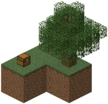

# SkyBlock

## Introduction

**Skyblock** is one of the most popular survival gamemodes. The gamemode is about creating and expanding your very own world infinitely with only minimal materials. You start on a small island floating in the middle of void with a few basic items and a single tree. You  must survive and expand this island. You must learn to use and preserve your materials wisely, since each material has a strategic use, and wasting any of them could be disastrous. For example, lava buckets have a *very* important use! You need to also know the basics of Minecraft in order to complete challenges and expand. 

It is normal to make mistakes, that may even require restarts, when you just start playing.

## Commands

On TrixMC we have a set of commands that you can use to manage your SkyBlock world. The commands are of the format `/is <command>`. The commands are listed below:

### `controlpanel`

`/is controlpanel` is an all-in-one command that opens a GUI that allows you to manage your TrixMC SkyBlock world.

### `ban`

`/is ban <player>` is used to ban a player from your Island.

### `banlist`

`/is banlist` is used to list all players banned from your island.

### `biomes`

`/is biomes` is used to buy and set the biome for your island. More info about biomes can be found in [Biomes](#biomes-1).

### `challenges`

`/is challenges` is used to view the challenges. More info about challenges can be found in [Challenges](#challenges-1).

### `create`

`/is create` is used to create your island.

### `fly`

`/is fly` is used to toggle flying on your island. More info about fly can be found in [Fly](#fly-1).

### `generator`

`/is generator` is used to buy and upgrade your cobblestone generator. More info about generator can be found in [Generator](#generator-1).

### `go`

`/is go` is used to teleport to your island.

### `info`

`/is info` is used to view island information.

### `language`

`/is language` is used to change the language.

### `level`

`/is level <player>` is used to calculate your island level or mentioned player's level.

### `reset`

`/is reset` is used to reset your island. WARNING: ALL PROGRESS WILL BE LOST IF YOU USE THIS COMMAND.

### `sethome`

`/is sethome` is used to set your home teleport point.

### `setname`

`/is setname` is used to set the name of your island.

### `settings`

`/is settings` is used to view and change your island settings. More info about settings can be found in [Settings](#settings-1).

### `resetname`

`/is resetname` is used to reset the name of your island.

### `unban`

`/is unban <player>` is used to unban a player from your Island.

### `team`

1. `/is team` is used to manage your team.
2. `/is team accept` is used to accept a team invite.
3. `/is team coop` is used to make a player coop rank on your island.
4. `/is team demote` is used to demote a player down a rank.
5. `/is team leave` is used to leave the team you are part of. Doesn't work if you are the island Owner.
6. `/is team invite` is used to invite a player to join your island.
7. `/is team kick` is used to kick a player from your island.
8. `/is team promote` is used to promote a player up a rank.
9. `/is team reject` is used to reject a team invite.
10. `/is team setowner` is used to transfer ownership of the island to another player.
11. `/is team uncoop` is used to remove the coop role from a player.
12. `/is team untrust` is used to untrust a player on your island.

Learn more about teams in [Teams](#Teams).

### `top`

`/is top` is used to show the top ten islands on TrixMC SkyBlock.

### `warp`

`/is warp <player>` is used to warp to a player's island.

### `warps`

`/is warps` is used to list all available warps on TrixMC SkyBlock. More info on warps can be found in [Warps](#Warps-1).

### `bank`

`/is bank deposit <amount>` is used to deposit money into your island bank from your wallet.
`/is bank withdraw <amount>` is used to withdraw money into your island bank from your wallet.
`/is bank balance` is used to view your island bank balance.
`/is bank statement` is used to view your island bank statement.

More info on money and bank can be found in [Money](#Money).

### `balance`

`/balance` is used to check your wallet balance.

More info on money and bank can be found in [Money](#Money).

### `chat`

`/is chat` is used to toggle island chat on and off. This allows you to communicate with ONLY your teammates.

### `teamchat`

`/is teamchat` is used to toggle team chat. This allows you to communicate with ONLY those in your team.

## Island Types

There are many different types of islands you can choose from while creating an island on TrixMC SkyBlock.

### List of island Types

A list of island types shall be added in the near future.

## Money

As you progress, you will need to use money and make transactions. Money is stored in one of two places: wallet or bank. You can see the balance of both on the right hand side of your screen.

### Interest

For money stored in your bank, you recieve an interest. The interest is credited every hour you are online. The rate of interest is not revealed and keeps changing.

## Challenges

Challenges let you complete various tasks and recieve rewards. These rewards are in the form of items and experience. These items are useful in your journey to beat the gamemode. You can check your challenges using the command [`/is challenges`](#challenges).

### List of Challenges

This list shall be added in the near future.

## Settings

Settings allow you to customize your island. You can view and change your settings using the command [`/is settings`](#settings).

There are currently 59 Protection Settings, 6 General Settings and 17 SkyBlock Island Settings that can be applied to the SkyBlock Island. Each of which ENABLE or DISABLE access to one or more types of players: Visitor, Coop, Trusted, Member, Sub-Owner and Owners for that island.

### List of settings

<!-- The below table was copy pasted from the BentoBox wiki -->

<table width="100%" align="center"> <tbody><tr> <td align="left" valign="top"><b>Settings</b></td> <td align="left"><b>Flags to enable or disable</b></td> </tr> <tr> <td align="left" valign="top">Protection Settings</td> <td align="left">Animal riding, Anvils, Armor stands, Beacons, Beds, Break blocks, Breed animals, Brewing stands, Buckets, Buttons, Chorus fruits, Collect lava, Collect water, Egg throwing, Enchanting Table, End Portal, EnderPearls, Experience pickup, Fire, Fire extinguish, Fish scooping, Frost walker, Furnace, Gates, Hurt animals, Hurt monsters, Hurt villagers, Item drop, Item pickup, Jukebox use, Leash use, Lever use, Lock island, Milking, Mount inventory, Name tags, Nether Portal, Note block, Place blocks, Pressure Plates, Redstone items, Shearing, Spawn eggs, Next Page (sign), TNT damage, Trample crops, Trap doors, Turtle Eggs, Use doors, Villager trading, Workbenches, Use containers, Use dispensers, Use droppers, Use hoppers, Use Item Frames, Throw Potions, Previous Page (sign)</td> </tr> <tr> <td align="left" valign="top">General Settings</td> <td align="left">Animal spawning, End PVP, Fire spread, Monster spawning, Nether PVP, Overworld PVP</td> </tr> <tr> <td align="left" valign="top">BSkyBlock Settings</td> <td align="left">Chest damage, Clean Super Flat, Coarse dirt tilling, Creeper damage, Creeper griefing, Ender Chests, Enderman griefing, Enter/Exit messages, Island respawn, Offline Redstone, Piston Push, Remove monsters, Obsidian Scooping, Feather Fall Teleporting, Command Ranks, Invincible Visitors, Limit mobs to island</td> </tr> </tbody></table>

## Fly

You can fly inside your island on TrixMC SkyBlock using the [`/is fly`](#fly) command.

### Timeout

If you leave your island, your fly will timeout after 5 seconds. This is also the case when you visit other's islands.

## Teams

Teams are a way for multiple players to collaborate on a single island. team commands are [`/is team`](#team).

### Team Roles

1. Coop
2. Trusted
3. Member
4. Sub-Owner
5. Owners

## Biomes

**Biomes** allow the user to change the biome on their island.

You need to buy biomes using the [`/is biomes`](#biomes) command. You can then apply the biome on the same menu.

### Working

Choose a biome form the list. Choose how large area is affected and apply it. After that, in the area, the biome is changed. But due to the minecraft structure, it is possible, that players need to unload the area (easiest, go to other's island, and then come back), for seeing the effect.

### Available biomes

These are the available biomes on TrixMC SkyBlock:

1. [**Deep Ocean**](https://minecraft.fandom.com/wiki/Ocean#Deep_Ocean) Unlocked at level 1. Costs $500.
2. [**Warm Ocean**](https://minecraft.fandom.com/wiki/Ocean#Warm_Ocean) Unlocked at level 10. Costs $500
3. [**Frozen Ocean**](https://minecraft.fandom.com/wiki/Ocean#Frozen_Ocean) Unlocked at level 20. Costs $500
4. [**Lush Caves**](https://minecraft.fandom.com/wiki/Lush_Caves) Unlocked at level 50. Costs $500
5. [**Plains**](https://minecraft.fandom.com/wiki/Plains) Unlocked at level 1. Costs $100
6. [**Taiga**](https://minecraft.fandom.com/wiki/Taiga) Unlocked at level 1. Costs $100
7. [**Snowy Taiga**](https://minecraft.fandom.com/wiki/Snowy_Taiga) Unlocked at level 50. Costs $500
8. [**Snowy Slopes**](https://minecraft-archive.fandom.com/wiki/Snowy_Slopes) Unlocked at level 75. Costs $1000
9. [**Savannah Plateau**](https://minecraft.fandom.com/wiki/Savanna#Savanna_Plateau) Unlocked at level 50. Costs $200
10. [**Mushroom Fields**](https://minecraft.fandom.com/wiki/Mushroom_Fields) Unlocked at level 150. Costs $4000
11. [**Jungle**](https://minecraft.fandom.com/wiki/Jungle) Unlocked at level 50. Costs $200
12. [**Beach**](https://minecraft.fandom.com/wiki/Beach) Unlocked at level 25. Costs $200
13. [**Desert**](https://minecraft.fandom.com/wiki/Desert) Unlocked at level 25. Costs $500
14. [**Flower Forest**](https://minecraft.fandom.com/wiki/Forest#Flower_Forest) Unlocked at level 75. Costs $500
15. [**Swamp**](https://minecraft.fandom.com/wiki/Swamp) Unlocked at level 75. Costs $500
16. [**Nether Wastes**](https://minecraft.fandom.com/wiki/Nether_Wastes) Unlocked at level 250. Costs $1000
17. [**Basalt Delta**](https://minecraft.fandom.com/wiki/Basalt_Delta) Unlocked at level 250. Costs $1000
18. [**Soul Sand Valley**](https://minecraft.fandom.com/wiki/Soul_Sand_Valley) Unlocked at level 250. Costs $1000
19. [**Crimson Forest**](https://minecraft.fandom.com/wiki/Crimson_Forest) Unlocked at level 250. Costs $1000
20. [**Warped Forest**](https://minecraft.fandom.com/wiki/Warped_Forest) Unlocked at level 250. Costs $1000

## Generator

The cobblestone generator is a way to generate cobblestone on your island. This generator can be upgraded using the [`/is generator`](#generator) command. There are different types of generators. These affect both cobblestone generators and basalt generators.

### Tiers of Generators

1. **Starting generator**: This is the basic generator everyone starts with. It generates:
   - Stone
   - Cobblestone
   - Gravel
   - Granite
   - Diorite
   - Andesite
   - Coal (A very very small chance to generate)
2. **Coal Generator**: This is the first upgrade for the cobblestone generator. Available at island level 20 and costs $20. It generates:
   - Stone
   - Cobblestone
   - Gravel
   - Granite
   - Diorite
   - Andesite
   - Coal Ore
   - Iron (A very small chance to generate)
3. **Iron Generator**: This is the second upgrade for the cobblestone generator. Available at island level 50 and costs $5. It generates:
   - Stone
   - Cobblestone
   - Gravel
   - Granite
   - Diorite
   - Andesite
   - Coal Ore
   - Iron Ore
   - Gold (A very small chance to generate)
4. **Gold Generator**: This is the third upgrade for the cobblestone generator. Available at island level 100 and costs $5. It generates:
   - Stone
   - Cobblestone
   - Gravel
   - Granite
   - Diorite
   - Andesite
   - Coal Ore
   - Iron Ore
   - Gold Ore
   - Redstone (A very small chance to generate)
5. **Redstone Generator**: This is the fourth upgrade for the cobblestone generator. Available at island level 150 and costs $5. It generates:
   - Stone
   - Cobblestone
   - Gravel
   - Granite
   - Diorite
   - Andesite
   - Coal Ore
   - Iron Ore
   - Gold Ore
   - Redstone Ore
   - Emerald (A very small chance to generate)
6. **Emerald Generator**: This is the fifth upgrade for the cobblestone generator. Available at island level 200 and costs $5. It generates:
   - Stone
   - Cobblestone
   - Gravel
   - Granite
   - Diorite
   - Andesite
   - Coal Ore
   - Iron Ore
   - Gold Ore
   - Redstone Ore
   - Emerald Ore
   - Diamond (A very small chance to generate)
7. **Diamond Generator**: This is the sixth upgrade for the cobblestone generator. Available at island level 250 and costs $5. It generates:
   - Stone
   - Cobblestone
   - Gravel
   - Granite
   - Diorite
   - Andesite
   - Coal Ore
   - Iron Ore
   - Gold Ore
   - Redstone Ore
   - Emerald Ore
   - Diamond Ore
8. **Basalt Generator**: This is the basic basalt generator in the nether. It generates:
   - Basalt
   - Netherrack
   - Gravel
   - Gold (A very small chance to generate)
9. **Nether Generator**: This is the only upgrade for the basic basalt generator. It generates:
   - Basalt
   - Soul Sand
   - Glowstone
   - Nether Quartz
   - Ancient Debris
   - Nether Gold Ore
   - Netherrack
   - Warped Nylium
   - Crimson Nylium

## Dimensional Trees

When a `jungle sapling` is grown in the nether or end, it generates a special kind of tree.

### nether

In the nether leaves are replaced by `Glowstone` and the bark is replaced by `gravel`.

### end

In the End leaves are replaced by `end_stone` and the bark is replaced by `purpur_block`.

## Mob spawning

In the nether and end, a few mobs are replaced by other mobs (e.g. `zombie pigman` is replaced by `Wither skeleton`). There is a chance that the mob is replaced by another mob.

### Replacements

1. **Zombie Pigmen** maybe replaced by **Wither Sketons** or **Blazes** if the pigman is standing on a block of `nether brick`, `nether brick slab` or `nether brick stair`.
2. **Endermen** maybe replaced by **Shulkers** if the enderman is standing on a block of `purpur block`, `purpur slab` or `purpur stair`.
3. **Cod** maybe replaced by **Guardians** if the cod is in a `deep ocean biome` and the first block above the fish on spawn is `prismarine`, `prismarine slab`, `prismarine stair`, `prismarine brick`, `prismarine brick slab`, `prismarine brick stair`, `dark prismarine`, `dark prismarine slab` or `dark prismarine stair`.

## Warps

Warps allow players to quickly travel from one place to another on TrixMC Skyblock. Warps can be used using [`/is warps`](#warps).

### Warp Restriction

You need to be atleast level 10 in order to be able to make warps.

### Creating Warps

Creating warps is easy! Just place a sign and the first line must say `[WELCOME]` (Not case sensitive) and you are done!
